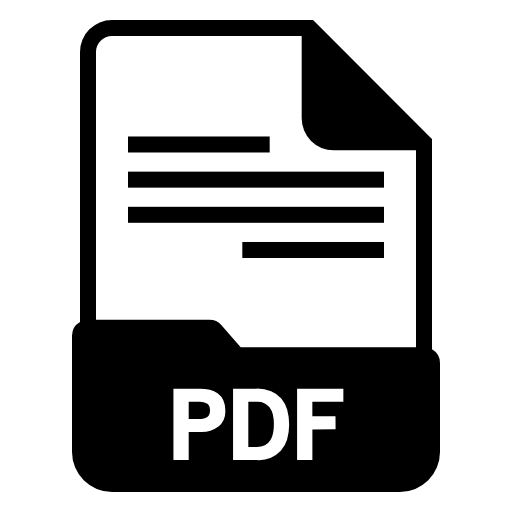

<p align="center">
  
</p>

<h1 align="center">LocalPDF Studio</h1>

<p align="center">
  <strong>Toolkit PDF offline lengkap yang berjalan 100% lokal di komputer Anda.</strong><br>
  Cepat · Privat · Tanpa Batas Ukuran · Tanpa Internet
</p>

<p align="center">
  
  
  
  
</p>

---

## 🔒 Mengapa LocalPDF Studio?

Kebanyakan tools PDF online mengharuskan Anda **mengunggah dokumen ke server** — artinya data sensitif Anda melewati internet dan tersimpan di server orang lain. LocalPDF Studio menghilangkan risiko itu sepenuhnya:

- **100% Offline** — Semua proses berjalan di mesin lokal Anda, tanpa koneksi internet
- **Tanpa Batas** — Tidak ada batasan ukuran file, jumlah halaman, atau kuota harian
- **Privat** — Tidak ada telemetry, analytics, atau data yang dikirim ke luar
- **Cepat** — Engine PyMuPDF berkinerja tinggi, langsung memproses tanpa antrian upload/download

---

## 📥 Download

| Versi | Tanggal | Download | Catatan |
|-------|---------|----------|---------|
| **v1.2.0** (Terbaru) | September 2026 | [⬇️ Download Installer](https://github.com/maulanaa12/fileConverter/releases/latest) | Security hardening, 3-level compress, dependency pinning |
| v1.1.0 | September 2026 | [⬇️ Download Installer](https://github.com/maulanaa12/fileConverter/releases) | Semua 7 fitur inti, desktop wrapper, native folder picker |

> **Persyaratan Sistem**: Windows 10/11 (64-bit). Tidak perlu install Python — semua sudah di-bundle dalam installer.

### Instalasi

1. Download file `.exe` dari tabel di atas
2. Jalankan installer dan ikuti petunjuk di layar
3. Buka **LocalPDF Studio** dari Start Menu atau Desktop shortcut
4. Selesai — langsung bisa dipakai tanpa konfigurasi tambahan

### Menjalankan Tanpa Installer (Developer Mode)

```bash
# Clone repository
git clone https://github.com/maulanaa12/fileConverter.git
cd fileConverter

# Install dependencies
pip install -r requirements.txt
npm install && npm run vendor && npm run build:css

# Jalankan server
python app.py

# Buka browser di http://localhost:8000
```

---

## 🛠️ Fitur Lengkap

### 📑 Merge PDF
Gabungkan beberapa file PDF menjadi satu dokumen. Mendukung:
- Drag-and-drop untuk mengatur urutan file
- Rotasi per halaman (0°, 90°, 180°, 270°)
- Seleksi halaman tertentu dari setiap file

### 🖼️ Image to PDF
Konversi gambar (JPG, PNG, WEBP, BMP, TIFF) ke PDF dengan opsi lengkap:
- Mode gabung (semua gambar → 1 PDF) atau terpisah (per gambar → masing-masing PDF)
- Ukuran kertas: Fit, A4, Letter, Legal
- Orientasi: Auto, Portrait, Landscape
- Margin: None, Small, Big
- Custom grouping (misal: gambar 1-5 → 1 PDF, gambar 6-10 → 1 PDF)
- Penamaan: original atau sequence dengan prefix/suffix

### 📷 PDF to Image
Ekstrak halaman PDF menjadi gambar berkualitas tinggi:
- Format output: JPG atau PNG
- DPI kustom (default 150)
- Seleksi halaman tertentu
- Output: ZIP berisi semua halaman

### ✏️ Batch Rename
Rename massal file dengan 4 mode:
- **Sequence** — Nomor urut terpadu (prefix + nomor + suffix)
- **Shift** — Geser nomor dalam nama file (misal: scan_005 → scan_008)
- **Replace** — Cari & ganti teks (mendukung regex)
- **Add Prefix/Suffix** — Tambahkan awalan/akhiran
- **Undo** — Batalkan rename terakhir dari file `rename_history.json`

### ✂️ Split PDF
Pisahkan PDF menjadi beberapa file:
- **Ranges** — Berdasarkan rentang halaman (misal: 1-3, 4-6, 7-10)
- **Single Pages** — Setiap halaman → 1 file PDF
- **Extract Selected** — Pilih halaman tertentu → 1 PDF baru

### 📄 Organize Pages
Atur ulang halaman PDF secara visual:
- Drag-and-drop untuk mengubah urutan halaman
- Rotasi per halaman
- Hapus halaman yang tidak diinginkan

### 📦 Compress PDF
Perkecil ukuran file PDF dengan 3 level kompresi:

| Level | Strategi | Cocok Untuk |
|-------|----------|-------------|
| 🟢 **Ringan** | Lossless — optimasi struktur, gambar tidak diubah | Dokumen yang butuh kualitas gambar utuh |
| ⚡ **Optimal** | Balanced — struktur + rekompresi gambar (quality 85) | Penggunaan sehari-hari *(default)* |
| 🔴 **Maksimal** | Aggressive — kompresi maksimum (quality 50, DPI 96) | Dokumen untuk email / arsip |

---

## 🏗️ Tech Stack

| Layer | Teknologi |
|-------|-----------|
| **Backend** | Python 3, FastAPI, Uvicorn |
| **PDF Engine** | PyMuPDF (fitz), pypdf |
| **Image Processing** | Pillow (PIL) |
| **Frontend** | Jinja2, Tailwind CSS, Vanilla JS |
| **Icons** | Lucide Icons |
| **Drag & Drop** | SortableJS |
| **Desktop Wrapper** | Edge App Mode / PyWebView |
| **Installer** | PyInstaller + Inno Setup |
| **Security** | AllowedDirRegistry, slowapi rate limiter, CORS |

---

## 📋 Changelog

### v1.2.0 — September 2026
**Security Hardening & UX Fix**

**Keamanan:**
- ✅ `AllowedDirRegistry` — Hanya folder yang dipilih via native picker yang bisa diakses API
- ✅ Path traversal protection pada semua endpoint filesystem
- ✅ ReDoS protection pada regex rename (timeout 2 detik)
- ✅ Download path validation 3-layer defense
- ✅ CORS middleware dengan explicit origin allowlist
- ✅ Rate limiting (slowapi) — tiered: heavy/upload/mutation/general
- ✅ Error message sanitization — filesystem paths di-strip dari response
- ✅ Swagger/ReDoc/OpenAPI disabled
- ✅ ZIP Slip prevention

**Fitur & Perbaikan:**
- ✅ Compress PDF sekarang memiliki 3 level berbeda yang benar-benar bekerja (low/medium/high)
- ✅ UI compress menampilkan 3 radio button dengan deskripsi jelas
- ✅ Semua dependency di-pin ke versi exact untuk reproducible builds

**Modul Baru:**
- `core/path_security.py` — Modul keamanan path filesystem
- `core/rate_limiter.py` — Konfigurasi rate limiting

**Tests:**
- 35 test cases (security-focused)

---

### v1.1.0 — September 2026
**Rilis Awal Publik**

- 🎉 7 fitur inti: Merge, Image→PDF, PDF→Image, Batch Rename, Split, Organize, Compress
- 🖥️ Desktop wrapper (Edge App Mode + PyWebView + browser fallback)
- 📂 Native Windows folder picker (IFileOpenDialog via COM/ctypes)
- 🗑️ Delete to Recycle Bin (Windows shell operation)
- 🌙 Dark mode dengan anti-FOUC guard
- 📱 Responsive design (mobile scrollable nav)
- ⬆️ Back-to-top floating button
- 🔔 Toast notification system
- 📦 PyInstaller + Inno Setup installer (~90MB)

---

## 🧑‍💻 Development

### Prasyarat

- Python 3.10+
- Node.js 18+ (untuk build Tailwind CSS)
- Windows 10/11 (fitur folder picker dan recycle bin bersifat Windows-specific)

### Setup

```bash
# Clone
git clone https://github.com/maulanaa12/fileConverter.git
cd fileConverter

# Python dependencies
pip install -r requirements.txt

# Frontend dependencies
npm install
npm run vendor    # Copy Lucide, SortableJS, fonts ke static/
npm run build:css # Build Tailwind CSS

# Jalankan development server
python app.py
# → http://localhost:8000
```

### Build Installer

```bash
# Pastikan PyInstaller dan Inno Setup 6 terpasang
pip install pyinstaller

# Jalankan build script
.\build_desktop.bat
# Output: dist/LocalPDFStudio/ (portable)
# Output: installer/output/LocalPDF_Studio_Setup.exe (installer)
```

### Menjalankan Tests

```bash
pip install pytest
python -m pytest tests/ -v
```

---

## 📁 Struktur Proyek

```
fileConverter/
├── app.py                  # FastAPI application (entry point web)
├── desktop_app.py          # Desktop wrapper (entry point installer)
├── core/                   # Core processing engine
│   ├── merger.py           # PDF merge
│   ├── image_converter.py  # Image ↔ PDF conversion
│   ├── splitter.py         # PDF split & organize pages
│   ├── renamer.py          # Batch file rename
│   ├── compressor.py       # PDF compression (3 levels)
│   ├── utils.py            # Shared utilities
│   ├── path_security.py    # AllowedDirRegistry & validation
│   └── rate_limiter.py     # slowapi configuration
├── templates/              # Jinja2 HTML templates
├── static/                 # CSS, JS, fonts, icons
├── tests/                  # Security & integration tests
├── scripts/                # Build & utility scripts
├── installer/              # Inno Setup installer config
├── localpdf.spec           # PyInstaller spec file
├── build_desktop.bat       # One-click build script
├── requirements.txt        # Python dependencies (pinned)
└── package.json            # Frontend tooling config
```

---

## 📄 Lisensi

MIT License © 2026 LocalPDF Studio

---

<p align="center">
  <sub>Dibuat dengan ❤️ untuk pengguna yang peduli privasi.</sub>
</p>
